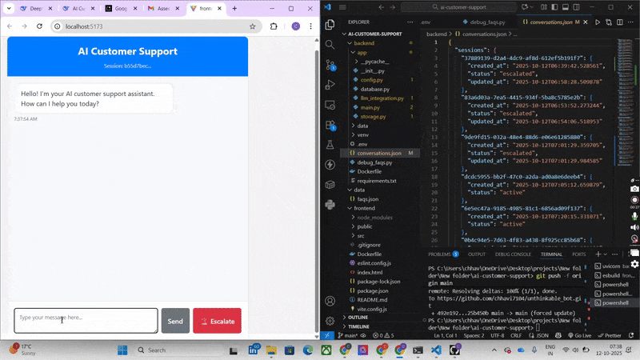

# AI Customer Support Bot
A sophisticated customer support chatbot with FAQ handling, contextual memory, and escalation capabilities.

## Features

- 🤖 AI-powered responses using OpenAI GPT
- 💬 Contextual conversation memory
- 📚 FAQ-based response generation
- 🚨 Smart escalation system
- 💾 Session management and tracking
- 🎨 Modern chat interface

## Setup Instructions

### Prerequisites
- Python 3.8+
- Node.js 16+
- Gemini API key 

### Backend Setup
1. Navigate to backend directory:
   ```bash
   cd backend

# AI Customer Support Bot

## Demo Video 
<a href="./unthinkable.mp4" style="color: black; text-decoration: none !important ;">
  🎥 Watch Demo Video
</a>





